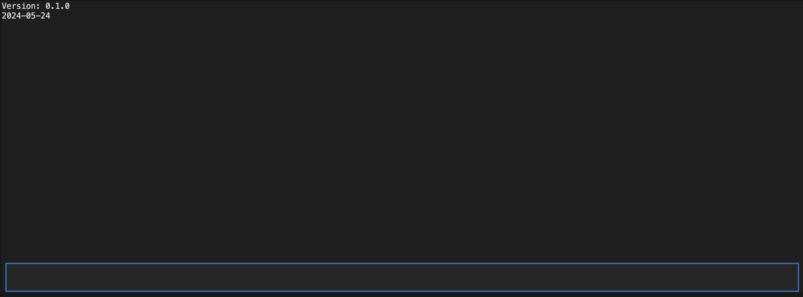
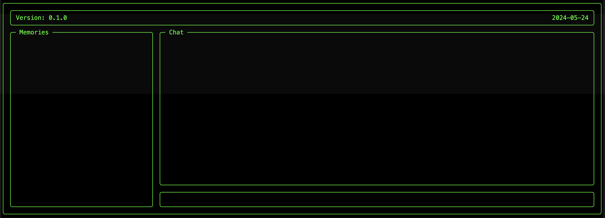
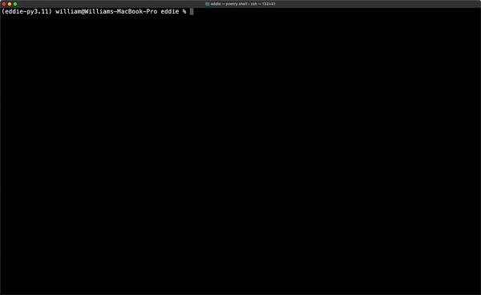

# Eddie -- Retro Textual App

It's time to give Eddie that retro on-board computer feel. We're going to use [Textual](https://textual.textualize.io/) to achieve this. Let's first add the dependency:

```shell
poetry add textual
poetry add --group dev textual-dev
```

Now, let's create the basic scaffolding for our app, namely `app.py`:

```python
# eddie_cli/app.py
import datetime
import importlib.metadata

from textual.app import App, ComposeResult
from textual.containers import Container, ScrollableContainer, Vertical
from textual.widgets import Input, Static


class MemoriesContainer(ScrollableContainer):
    """The container for Eddie's memories."""

    BORDER_TITLE = "Memories"


class ChatInput(Input):
    """The input for user messages."""


class ChatMessages(ScrollableContainer):
    """The container for chat messages."""

    BORDER_TITLE = "Chat"

    def compose(self) -> ComposeResult:
        yield Static(
            "Eddie: Oh, look who it is. In need of some assistance then?",
            classes="chat-message",
        )


class ChatContainer(Vertical):
    """The container for the chat input and messages."""

    def compose(self) -> ComposeResult:
        yield ChatMessages()
        yield ChatInput()

    def on_mount(self) -> None:
        self.query_one(ChatInput).focus()


class EddieApp(App):
    """Eddie - the retro AI-powered CLI assistant."""

    def compose(self) -> ComposeResult:
        """Create child widgets for the app."""
        yield Container(
            Static(
                f"Version: {importlib.metadata.version('eddie')}", classes="topbar-left"
            ),
            Static(f"{datetime.datetime.now().date()}", classes="topbar-right"),
            id="topbar",
        )
        yield Container(
            MemoriesContainer(id="memories-container"),
            ChatContainer(),
            id="memories-chat",
        )


__all__ = ("EddieApp",)
```

Let's break this down:

1. We have the main `EddieApp` from which we can launch the app.
2. We have a top bar that will display general information like the version and the date.
3. We have another container that will have memories on the left side and the chat interface on the right side.

Adding an `eddie run` command now is simple:

```python
# eddie_cli/main.py
@cli.command()
def run(dev: bool = False):
    """Run Eddie's retro Textual app."""
    eddie = EddieApp(watch_css=dev)
    eddie.run()
```

Running the app gives us a sense of how we need to update the style:



We have our work cut out for us!

## Styling Eddie (to look retro)

While styling Eddie, we can take advantage of the live editing feature to see the style change live as we update the `app.tcss` file. First we need to create `app.tcss` and add it as the CSS file for the app:

```python
class EddieApp(App):
    ...

    CSS_PATH = "app.tcss"
```

Now we can run `eddie run --dev` and live edit our styles!

```tcss
# eddie_cli/app.tcss
Screen {
    border: round #00FF00;
    color: #00FF00;
    background: #000000;
    padding: 0 1;
}

#topbar {
    layout: grid;
    grid-size: 2;
    padding: 0 1;
    border: round #00FF00;
    content-align: left middle;
    min-height: 3;
    max-height: 3;
}

.topbar-left {
    content-align: left middle;
}

.topbar-right {
    content-align: right middle;
}

#memories-chat {
    layout: horizontal;
}

MemoriesContainer {
    width: 1fr;
    color: #00FF00;
    border: round #00FF00;
    padding: 0 1;
    margin: 0 1 0 0;
}

.memory {
    margin: 1 0 0 0;
}

ChatContainer {
    width: 3fr;
}

ChatMessages {
    background: #000000;
    border: round #00FF00;
    padding: 0 1;
    scrollbar-color: gold;
    scrollbar-size-vertical: 1;
}

.chat-message {
    background: #000000;
    color: #00FF00;
    margin: 1 0 0 0;
}

ChatInput {
    dock: bottom;
    width: 100%;
    min-height: 3;
    background: #000000;
    color: #00FF00;
    border: round #00FF00;
    padding: 0 1;
}

ChatInput:focus {
    border: round #FFD700;
    padding: 0 1;
}
```



Looking stylish!!

## Getting `EddieApp` ready for `EddieChat`

First, we need to enable sending a user message. We can do this by handling the "enter" key and running a submit handler in our input, which in turn will add the user message to the chat messages container:

```python
from textual.events import Key
...


class ChatInput(Input):
    """The input for user messages."""

    def on_key(self, event: Key) -> None:
        if event.key == "enter":
            self.submit()

    def submit(self) -> None:
        message = self.value
        self.value = ""
        self.app.query_one(ChatMessages).add_message(message, True)
```

We can then update our `ChatMessages` with this new message:

```python
class ChatMessages(ScrollableContainer):
    """The container for chat messages."""

    BORDER_TITLE = "Chat"

    def add_message(self, message: str, is_user: bool) -> None:
        """Adds a new chat message."""
        sender = "You" if is_user else "Eddie"
        self.mount(
            Static(
                f"{sender}: {message}",
                classes="chat-message",
            )
        )
        self.scroll_end()
```

Next, we'll want Eddie to respond. For now, let's just render a hard-coded response to get things working, using `time.sleep` to simulate the streaming:

```python
class ChatInput(Input):
    ...

    def submit(self) -> None:
        message = self.value
        self.value = ""
        chat_messages = self.app.query_one(ChatMessages)
        chat_messages.add_message(message, True)
        self.call_next(chat_messages.add_streaming_message)

...

class ChatMessages(ScrollableContainer):
    ...

    def add_streaming_message(self) -> None:
        """Adds a placeholder for a streaming message."""
        self.mount(Static("Eddie: ...", classes="chat-message", id="streaming-message"))
        self.call_next(self.update_streaming_message)

    def update_streaming_message(self) -> None:
        """Updates the streaming placeholder message."""
        time.sleep(3)
        streaming_message = self.query_one("#streaming-message", Static)
        streaming_message.update("Eddie: PLACEHOLDER")
        self.scroll_end()
        self.refresh()
        self.call_after_refresh(self.finalize_streaming_message, "DONE STREAMING")

    def finalize_streaming_message(self, message: str) -> None:
        """Finalizes the streaming message into a normal message."""
        time.sleep(3)
        streaming_message = self.query_one("#streaming-message", Static)
        streaming_message.remove()
        self.add_message(message, False)
        self.scroll_end()
```

We can see that first we get the "Eddie: ..." thinking message, then we see "PLACEHOLDER" appear, and then we see "DONE STREAMING". Now we're ready to incorporate `EddieChat`.

## Hooking up `EddieChat` with `EddieApp`

First, let's create an instance of `EddieChat` when we first spin up the app:

```python
class EddieApp(App):
    ...

    eddie: EddieChat = EddieChat()
```

Next, let's update our chat messages to start with Eddie's first message:

```python
class ChatMessages(ScrollableContainer):
    ...

    def compose(self) -> ComposeResult:
        yield Static(
            f"Eddie: {self.app.eddie.first_message}",
            classes="chat-message",
        )
```

Let's also load Eddie's memories into the memory view:

```python
from textual.reactive import reactive

from .calls import EddieChat, load_memories
...


class MemoriesContainer(ScrollableContainer):
    ...

    memories: list[str] = reactive(load_memories, recompose=True)

    def compose(self) -> ComposeResult:
        for memory in self.memories:
            yield Static(memory, classes="memory")
```

Note that we've made `memories` reactive so that we can update them in the UI whenever Eddie adds a new memory.

Now we just need to remove `time.sleep` and use Eddie's `chat` method to finish up the app!

```python
class ChatMessages(ScrollableContainer):
    """The container for chat messages."""

    BORDER_TITLE = "Chat"

    def compose(self) -> ComposeResult:
        yield Static(
            f"Eddie: {self.app.eddie.first_message}",
            classes="chat-message",
        )

    def add_message(self, message: str, is_user: bool) -> None:
        """Adds a new chat message."""
        sender = "You" if is_user else "Eddie"
        self.mount(
            Static(
                f"{sender}: {message}",
                classes="chat-message",
            )
        )
        self.scroll_end()

    def add_streaming_message(self, message: str) -> None:
        """Adds a placeholder for a streaming message."""
        self.mount(Static("Eddie: ...", classes="chat-message", id="streaming-message"))
        asyncio.create_task(self.chat_with_eddie(message))

    async def chat_with_eddie(self, message: str) -> None:
        """Chats with Eddie based on the user `message`."""
        eddie_message = ""

        def update_and_refresh(content: str) -> None:
            nonlocal eddie_message
            eddie_message += content
            self.update_streaming_message(eddie_message)
            self.refresh()

        def handle_memory(memory: str) -> None:
            memories_container = self.app.query_one(MemoriesContainer)
            memories_container.memories = memories_container.memories + [memory]

        await asyncify(self.app.eddie.chat)(message, update_and_refresh, handle_memory)
        self.scroll_end()
        self.call_after_refresh(self.finalize_streaming_message, eddie_message)

    def update_streaming_message(self, content: str) -> None:
        """Updates the streaming placeholder message."""
        streaming_message = self.query_one("#streaming-message", Static)
        streaming_message.update(f"Eddie: {content}")
        self.scroll_end()

    def finalize_streaming_message(self, message: str) -> None:
        """Finalizes the streaming message into a normal message."""
        streaming_message = self.query_one("#streaming-message", Static)
        streaming_message.remove()
        self.add_message(message, False)
        self.scroll_end()
```

Note that to properly handle Textual's event loop, we've launched our chat with Eddie as an async task using the `asyncio.create_task` method and the `asyncify` method from [`Asyncer`](https://asyncer.tiangolo.com/). We have also updated the `memories` of the `MemoriesContainer` so that it dynamically updates.

And that's it, now we have a retro AI-powered CLI assistant!


